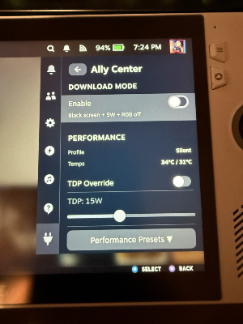
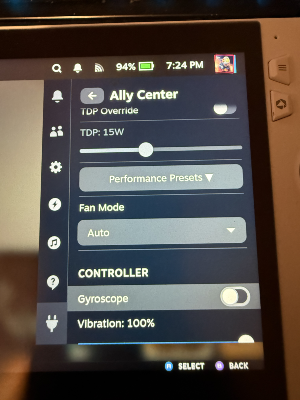
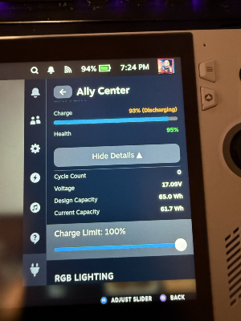
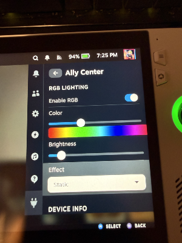
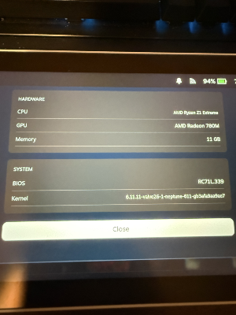

# Ally Center

A comprehensive Decky Loader plugin for the **ASUS ROG Ally** running SteamOS.







## Features

### Download Mode

Turn off the display for background downloads to save battery. When enabled:

- Screen brightness set to 0 (OLED pixels off)
- Automatically switches to 5W power profile
- RGB lighting disabled
- MCU powersave enabled (stops charging LED blink)
- Open the Quick Access Menu to exit

### Performance

- **Performance Presets** - Quick switch between Download (5W), Silent (15W), Performance (25W), and Turbo (30W) modes
- **TDP Override** - Manually set TDP from 5W to 30W with fine-grained control
- **Fan Mode** - Choose between Auto, Quiet, Balanced, and Performance fan profiles
- **Live Monitoring** - View current CPU and GPU temperatures in real-time

### CPU Settings

- **SMT (Hyper-Threading)** - Toggle on/off for better single-thread performance in some games
- **CPU Boost** - Disable to reduce heat and power consumption

### Battery

- **Charge Level** - Current battery percentage and charging status
- **Battery Health** - Monitor battery health percentage
- **Detailed Stats** - View cycle count, voltage, design capacity, current capacity, and temperature
- **Charge Limit** - Set maximum charge level (60-100%) to extend battery lifespan

### RGB Lighting

- **Color Selection** - Full color spectrum slider with preset colors (ROG Red, Cyan, Purple, Green, Orange, Pink, White, Blue)
- **Brightness Control** - Adjust LED brightness from 0-100%
- **Effects** - Static, Pulse, Spectrum, Wave, Flash, Battery Level, or Off
- **Speed Control** - Adjust animation speed for animated effects

### Device Info

View detailed system information:

- CPU model
- GPU model
- Memory total
- BIOS version
- Kernel version

## Requirements

- ASUS ROG Ally or ROG Ally X
- SteamOS (or compatible distro like Bazzite, ChimeraOS)
- [Decky Loader](https://github.com/SteamDeckHomebrew/decky-loader) installed

## Installation

### Quick Install (Recommended)

**Important:** Run this directly on your ROG Ally or via SSH.

**On your ROG Ally:**

1. Switch to Desktop Mode
2. Open Konsole (terminal)
3. Run:

```bash
curl -L https://github.com/PixelAddictUnlocked/allycenter/raw/main/install.sh | sh
```

**Via SSH:**

```bash
ssh deck@<your-ally-ip>
curl -L https://github.com/PixelAddictUnlocked/allycenter/raw/main/install.sh | sh
```

The installer will download the latest release, install it, and restart Decky Loader automatically.

### Manual Install

1. Download the latest release from the [Releases](https://github.com/PixelAddictUnlocked/allycenter/releases) page
2. Extract to `~/homebrew/plugins/Ally Center/`
3. Restart Decky Loader or reboot

## Usage

1. Press the **...** button on your ROG Ally to open the Quick Access Menu
2. Navigate to the **Decky** plugin icon (plug icon)
3. Select **Ally Center** from the plugin list
4. Use the toggles, sliders, and buttons to control your device

## Hardware Support

| Feature             | ROG Ally | ROG Ally X |
| ------------------- | -------- | ---------- |
| Download Mode       | ✅       | ✅         |
| Performance Presets | ✅       | ✅         |
| TDP Override        | ✅       | ✅         |
| Fan Control         | ✅       | ✅         |
| CPU Settings        | ✅       | ✅         |
| Battery Health      | ✅       | ✅         |
| Charge Limit        | ✅       | ✅         |
| RGB Lighting        | ✅       | ✅         |
| Device Info         | ✅       | ✅         |

## Settings

Your preferences are automatically saved and restored between sessions. Settings are stored in:

```
~/homebrew/settings/Ally Center/settings.json
```

## License

MIT License - see [LICENSE](LICENSE) for details.

## Credits

- [Decky Loader](https://github.com/SteamDeckHomebrew/decky-loader) - Plugin framework
- [HueSync](https://github.com/honjow/HueSync) - RGB inspiration
- [ASUS Linux](https://asus-linux.org) - Hardware documentation

## Support

- [GitHub Issues](https://github.com/PixelAddictUnlocked/allycenter/issues)
- [Discord](https://discord.gg/pixeladdictgames)
